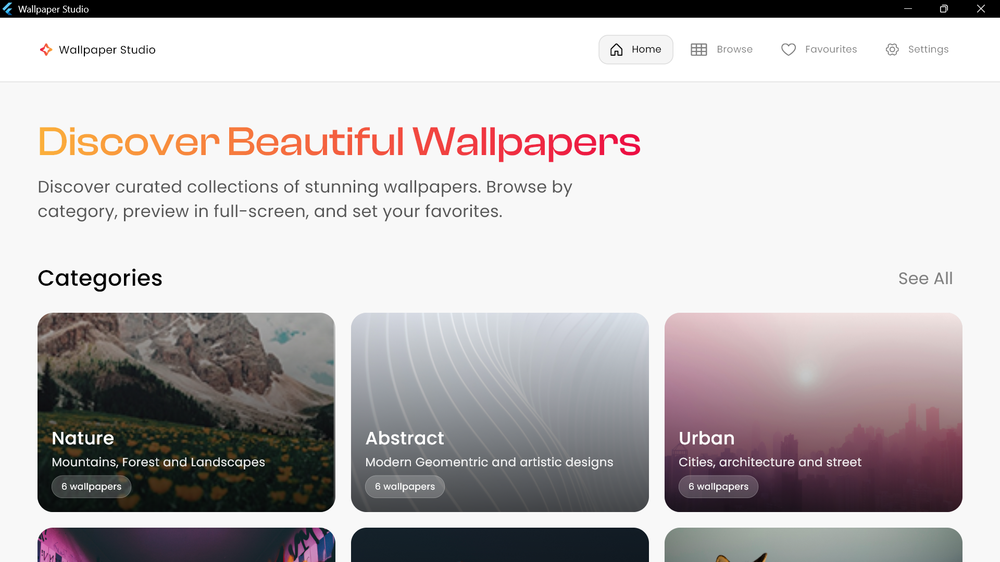
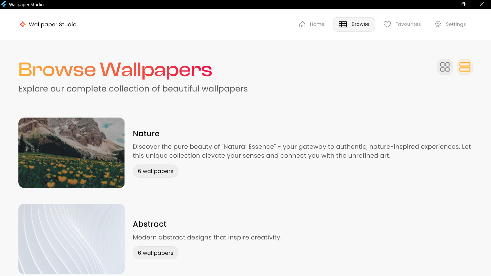
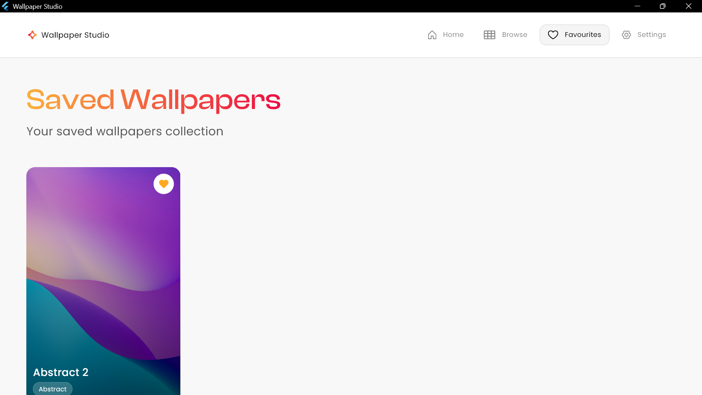
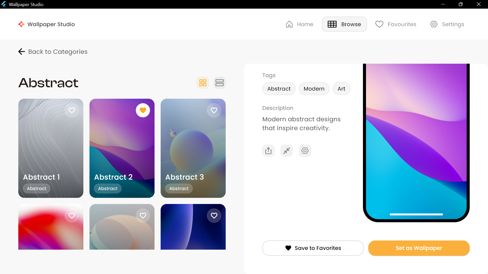
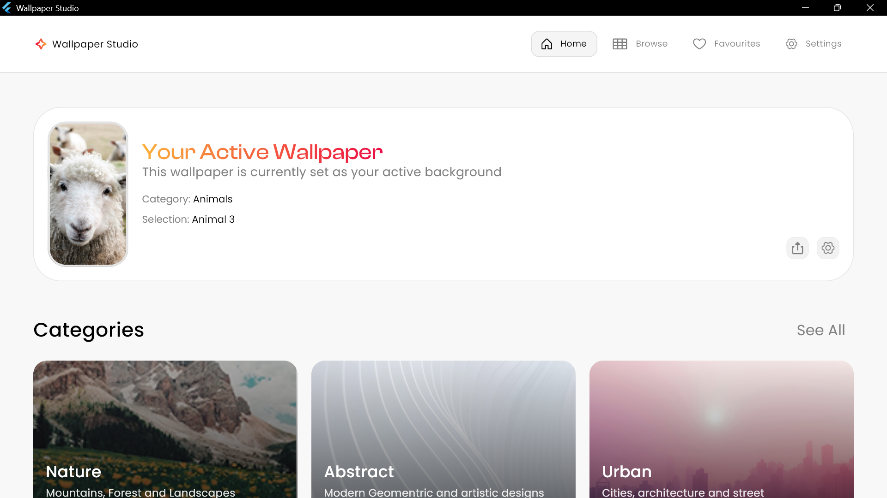

# Wallpaper Studio - Wallpaper Selector Desktop App

A beautiful, desktop wallpaper application built with Flutter that works seamlessly on desktop platforms.


---

## ✨ Features

- ✅ Browse beautiful wallpaper collections by category
- ✅ Grid and List view modes
- ✅ Save favorite wallpapers
- ✅ Preview wallpapers on phone mockup
- ✅ Set wallpapers directly
- ✅ Responsive design
- ✅ Persistent favorites and active wallpaper
- ✅ Advanced wallpaper settings

---

---

## 🚀 Getting Started

### Prerequisites

* Flutter SDK (3.9.2 or higher)
  ```bash
  flutter config --enable-windows-desktop
  flutter config --enable-macos-desktop
  flutter config --enable-linux-desktop
  ```
* Windows: Visual Studio with “Desktop development with C++”

* macOS: Xcode + Command Line Tools

* Linux: GTK 3.0+ and build tools

* VS Code or Android Studio with Flutter extension


### Installation

1.  **Clone the repository**

    ```bash
    git clone [https://github.com/Cobby-a/WallpaperSelector.git](https://github.com/Cobby-a/WallpaperSelector.git)
    cd storekeeper-app
    ```

### 2. Add Fonts

Download and add these fonts to `assets/fonts/`:

**Clash Display:**
- Download from: https://www.fontshare.com/fonts/clash-display
- Add: `ClashDisplay-Medium.ttf`

**Poppins:**
- Download from: https://fonts.google.com/specimen/Poppins
- Add: `Poppins-Regular.ttf` and `Poppins-Medium.ttf`


### 3. Add Wallpaper Images

Place your wallpaper images in `assets/wallpapers/`:
```
assets/wallpapers/
  ├── nature_1.jpg
  ├── nature_2.jpg
  ├── nature_3.jpg
  ├── nature_4.jpg
  ├── nature_5.jpg
  ├── nature_6.jpg
  ├── abstract_1.jpg
  └── ... (more images)
```

### 4. Add SVG Icons (Optional)

Export icons from Figma as SVG and place in `assets/icons/`

5.  **Install dependencies**

    ```bash
    flutter pub get
    ```

### 7. Run the App

```bash
# Desktop (Windows)
flutter run -d windows

# Desktop (macOS)
flutter run -d macos

# Desktop (Linux)
flutter run -d linux
```
## 🔧 Build for Production

### Windows
```bash
flutter build windows --release
```

### macOS
```bash
flutter build macos --release
```

### Linux
```bash
flutter build linux --release
```


## 🔗 Important Links

| Resource | Specification | Details / URL |
| :--- | :--- | :--- |
| **📂 GitHub Repository** | Source Code & Development | `https://github.com/Cobby-a/WallpaperSelector.git` |
| **🎥 Demo Video** | App Walkthrough & Features | [Google Drive Link](https://drive.google.com/file/d/19_DKhJt7kbwbzxBLSl5beeizHREP1Wcr/view?usp=drive_link) |
| **📥 Window Release** | Window Download Files | [Download v1.0.0](https://drive.google.com/file/d/1nKJCDTPLkIsNyH_tmgxRKJh7RX9DYWDO/view?usp=drive_link) |


## 📸 Screenshots
 
 [PreviewPage](assets/screenshots/preview.png)

